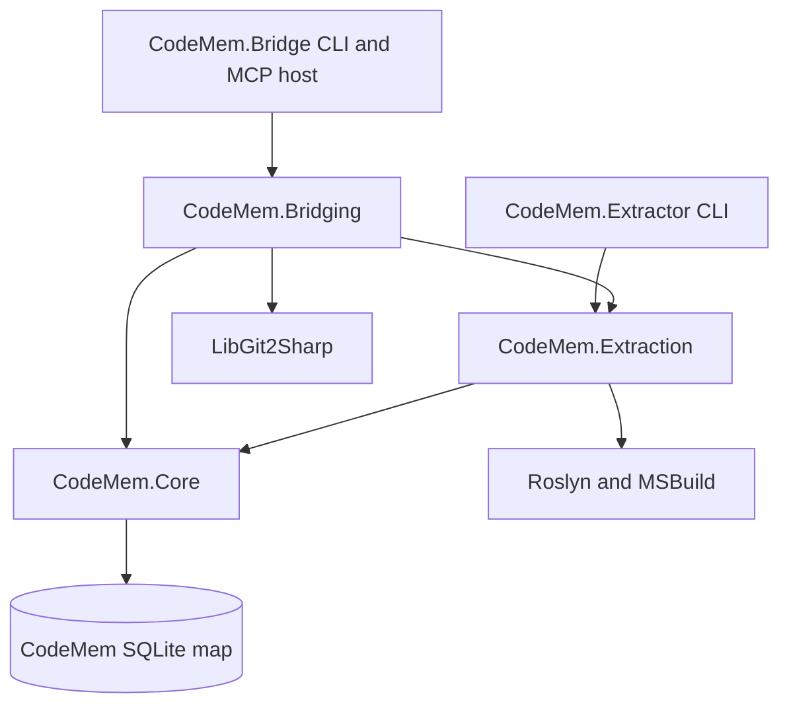

# CodeMem Project Review

**Review date:** 2026-09-17  
**Reviewed revision:** `145acf4` on `005-bridge-stands-alone`  
**Scope:** current production code under `src/`, tests under `tests/CodeMem.Tests/`, specifications `001` through `005`, build behavior, and selected operational failure paths. `_Archive/` was considered historical context, not current product code.

## Executive assessment

CodeMem has a strong concept and an unusually disciplined implementation for a young code-intelligence system. Its core proposition is coherent: derive compiler-backed VB.NET facts, publish them atomically to one SQLite map, preserve symbol identity across runs, and expose that map read-only through a narrowly scoped MCP bridge. The solution boundaries reinforce that model instead of fighting it.

The best parts are the transactional publication model, independent reconciliation audit, explicit schema/version gates, deterministic ordering, and a test suite that exercises real SQLite files and production executables. The specifications are substantially better than the usual repository documentation and make design intent auditable.

The project is not yet robust enough to call hardened for adversarial or highly concurrent use. Two high-priority issues affect core trust claims: the bridge constructs the extractor command as a raw argument string, allowing a crafted solution key to alter child arguments; and extraction does not prove that the source/Git state remained stable while facts and provenance were collected. Several medium issues affect availability and operations, especially read/write lock contention, uncaught process-launch failures, lack of cancellation, and simplistic shell-command parsing in the hook.

**Overall judgment:** strong controlled-workstation tool, with a sound data model and excellent verification habits; address the high findings and concurrency/cancellation behavior before treating it as a hardened multi-client service.

## Scorecard

| Area | Score | Assessment |
|---|---:|---|
| Product concept | 8.5/10 | Clear mission, valuable compiler-backed model, appropriately narrow first language/runtime scope. |
| Architecture | 8.5/10 | Clean dependency direction and ownership; executable projects are genuinely thin. |
| Data integrity | 8.5/10 | Atomic publication, schema gates, foreign keys, reconciliation accounting, and deterministic ordering are strong. |
| Implementation quality | 7.5/10 | Consistent VB discipline and clear code, with a few consequential boundary defects. |
| Security boundaries | 6.5/10 | Local stdio exposure limits the threat surface, but child argument construction violates the configured-map boundary. |
| Reliability/operations | 6.5/10 | Bounded child runtime and rollback are good; cancellation, launch failures, reader/writer overlap, and deployment locks need work. |
| Test quality | 9/10 | 197 passing behavioral tests, real databases/processes, failure injection, and strong invariant coverage. |
| Documentation | 9/10 | Exceptional feature records and contracts; a concise root-level entry document is still missing. |

Scores are engineering judgments, not coverage measurements.

## Evidence and method

- Reviewed 167 production `.vb` files and approximately 8,986 production lines.
- Reviewed 96 test/support `.vb` files and approximately 9,480 test lines, excluding fixture source and generated output.
- Reviewed 50 Markdown specification/contract documents across features `001`-`005`.
- Traced the extraction, schema migration, reconciliation, bridge read, status, hook, and child-process paths.
- Built all five production projects in Release to an isolated directory: succeeded with no compiler errors.
- Ran the complete Release suite from an isolated output beneath the test project: **206 total, 197 passed, 0 failed, 9 skipped**, in 201.3 seconds.
- The nine skips are one opt-in acceptance test and eight live-map tests; `CODEMEM_ACCEPT_SOLUTION` and `CODEMEM_LIVE_MAP` were not set.
- Reproduced F01 against the built extractor using the launcher's exact raw command construction: a crafted `solutionKey` injected a second `--db`; the child exited 0, created the alternate database, and did not create the configured database.
- Audited resolved direct and transitive NuGet packages with `dotnet list package --vulnerable`: no known vulnerabilities were reported.
- A normal in-place Release build was also attempted. It failed only because two running `CodeMem.Bridge` processes held output DLLs open, which is recorded below as an operational limitation.

The review combines static analysis with local build/test validation and a focused process-boundary probe. It did not mutate a live CodeMem map, run the opt-in live tests, perform a large-map benchmark, or conduct a network threat assessment; the product is a local stdio service.

## Architecture

The dependency direction is sensible:

- `CodeMem.Core` owns records, schema, SQLite connection creation, repositories, and reconciliation primitives.
- `CodeMem.Extraction` owns workspace loading, compilation, source/provenance collection, symbol/edge extraction, and publication orchestration.
- `CodeMem.Bridging` owns configuration, refusals, map readers, status calculation, extraction orchestration, hooks, and MCP-facing envelopes.
- `CodeMem.Extractor` and `CodeMem.Bridge` are thin composition/CLI projects.

This is a good modular monolith. There is no unnecessary service boundary, dependency direction is acyclic, and SQLite is appropriate for the local, single-map operating model.

## Priority findings

### F01 - High - Child arguments can be injected through `solutionKey`

**Evidence:** [ProcessExtractorLauncher.vb](../src/CodeMem.Bridging/Extract/ProcessExtractorLauncher.vb#L23-L35) builds one raw argument string and [wraps values in unescaped quotes](../src/CodeMem.Bridging/Extract/ProcessExtractorLauncher.vb#L62-L64). An explicit key/path pair is accepted without a map lookup in [TargetResolver.vb](../src/CodeMem.Bridging/Extract/TargetResolver.vb#L36-L41), and MCP strings are only trimmed in [BridgeTools.vb](../src/CodeMem.Bridging/Mcp/BridgeTools.vb#L236-L249).

`UseShellExecute = False` prevents shell expansion, but it does not make a raw command-line string structurally safe. On Windows the child still has to parse that string into arguments. A key containing a quote and additional option text can terminate the quoted key and inject another `--db` or `--solution-key`. Because the extractor parser accepts repeated options with the last value winning, a permitted MCP caller could redirect extraction away from the configured map.

This was confirmed at runtime with the built extractor. A crafted key containing a second `--db` made the process exit successfully and publish 38 symbols to the injected alternate path; the intended database was never created. A separate injected `--help` probe also exited 0 without creating a database.

The service is local and extraction is gated, so this is not a remote-code-execution claim. It is high severity because it breaks the central one-configured-map boundary and can create or modify another SQLite file under the bridge process identity.

**Recommendation:** build `ProcessStartInfo` with `ArgumentList.Add` for every token, including the DLL path when invoking `dotnet`; remove `Quote`. Add a production-launcher test with quotes, whitespace, semicolons, and leading dashes in a key, asserting the exact child argument vector and configured database path.

### F02 - High - Facts can be stamped with provenance from a different source state

**Evidence:** the transaction and workspace are opened before compilation in [ExtractionRun.vb](../src/CodeMem.Extraction/Run/ExtractionRun.vb#L47-L105); compilation then occurs before input hashing and Git inspection in [ExtractionRun.vb](../src/CodeMem.Extraction/Run/ExtractionRun.vb#L106-L132). Source documents come from the Roslyn snapshot, while project/build files are read from disk in [CompiledInputs.vb](../src/CodeMem.Extraction/Workspace/CompiledInputs.vb#L29-L64), and the current Git HEAD/status are read afterward in [GitProvenance.vb](../src/CodeMem.Extraction/Provenance/GitProvenance.vb#L20-L44).

No repository or filesystem snapshot spans those operations. If a commit, checkout, generated project-file change, or edit occurs during a long extraction, the compilation can represent state A while `source_digest`, project/build inputs, `commit_sha`, or `is_dirty` partly represent state B. The database transaction protects map publication, not source provenance.

This matters because exact provenance is one of CodeMem's core trust claims. The published map remains structurally consistent, but it may be attributed to the wrong commit or to a digest assembled from different moments.

**Recommendation:** capture a source-state token before loading and verify it again immediately before publication. At minimum compare HEAD and relevant working-tree status before/after; for stronger guarantees, hash every effective input from the same snapshot used to compile and abort with a named “source changed during extraction” result when any input changes. Add a test that mutates/commits a fixture at a seam between compilation and publication.

### F03 - Medium - A bridge reader can make a completed extraction fail at commit

**Evidence:** every bridge read starts a SQLite transaction in [MapAccess.vb](../src/CodeMem.Bridging/Reading/MapAccess.vb#L25-L58), and `RunRead` ends it only after the whole reader body and serialization in [BridgeTools.vb](../src/CodeMem.Bridging/Mcp/BridgeTools.vb#L253-L270). `map_status` performs Git history/status work and reads the append-only log inside that body in [MapStatusReader.vb](../src/CodeMem.Bridging/Status/MapStatusReader.vb#L30-L57). The writer selects rollback-journal mode and sets its native busy timeout to zero in [MapDatabase.vb](../src/CodeMem.Core/Repositories/MapDatabase.vb#L38-L48) and [MapDatabase.vb](../src/CodeMem.Core/Repositories/MapDatabase.vb#L132-L146).

Under SQLite rollback-journal semantics, an existing reader can coexist with a writer's reserved lock but block its final exclusive commit. With the writer timeout left at zero, a coincident `map_status` can therefore make an extraction that already spent seconds or minutes compiling and publishing roll back with `SQLITE_BUSY`. The suite proves snapshot locking and writer-vs-writer refusal, but does not exercise a real reader overlapping an extractor commit.

**Recommendation:** add a reader/writer integration test first. Then either use WAL mode, release the map transaction after eagerly materializing map facts and before Git/log work, or restore a bounded busy timeout after `BEGIN IMMEDIATE` succeeds so commit can wait briefly without weakening the instant second-writer refusal.

### F04 - Medium - Process-start failures escape the result/refusal/log contract

**Evidence:** [ProcessExtractorLauncher.vb](../src/CodeMem.Bridging/Extract/ProcessExtractorLauncher.vb#L36-L55) can throw for an inaccessible or invalid executable, failure to start `dotnet`, or process resource exhaustion. [ExtractDoor.vb](../src/CodeMem.Bridging/Extract/ExtractDoor.vb#L69-L130) catches only `BridgeRefusalException` and `SqliteException`. The existing precheck only proves that `extractorPath` exists.

An existing text file configured as the extractor, an executable denied by policy, or a missing `dotnet` host therefore bypasses `ExtractResult`, skips the normal `extract.log` append, and reaches the MCP host or command line as an unhandled exception. This contradicts the otherwise strong “named refusal/result at every boundary” design.

**Recommendation:** catch launch-related exceptions at the launcher/door boundary and return a typed `ChildLaunchFailed` result with a one-line diagnostic; always append the invocation in a `Finally`-style result path. Test the real launcher with an existing non-executable file and an inaccessible path.

### F05 - Medium - Cancellation does not propagate through MCP, extraction, or Roslyn

**Evidence:** the MCP server runs with `CancellationToken.None` in [BridgeServer.vb](../src/CodeMem.Bridge/Mcp/BridgeServer.vb#L29-L44). Tool bindings are synchronous in [BridgeToolBindings.vb](../src/CodeMem.Bridging/Mcp/BridgeToolBindings.vb#L24-L100). Roslyn calls synchronously wait without tokens in [SolutionLoader.vb](../src/CodeMem.Extraction/Workspace/SolutionLoader.vb#L70-L86) and [SolutionLoader.vb](../src/CodeMem.Extraction/Workspace/SolutionLoader.vb#L119-L140). The child has a fixed 540-second budget, but no caller cancellation in [ProcessExtractorLauncher.vb](../src/CodeMem.Bridging/Extract/ProcessExtractorLauncher.vb#L39-L55).

A cancelled MCP request or disconnected client can leave compilation or a child extraction running. `extract --stale` can repeat that budget for several solutions. Process termination eventually rolls SQLite back, but normal cancellation cannot release resources promptly or produce a clean result.

**Recommendation:** make tool bindings asynchronous, pass the request/server token through `ExtractDoor`, use `WaitForExitAsync` plus linked timeout cancellation, kill the child tree on cancellation, and pass the token to Roslyn APIs. Add cancellation tests before and during compilation and child execution.

### F06 - Medium - Hook command recognition is not token exact or quote aware

**Evidence:** [HookRequest.vb](../src/CodeMem.Bridging/Extract/HookRequest.vb#L59-L69) splits on shell separators without respecting quotes and recognizes a segment with `StartsWith("dotnet build")` / `StartsWith("dotnet test")`; tokenization is a separate minimal parser in [HookRequest.vb](../src/CodeMem.Bridging/Extract/HookRequest.vb#L110-L142).

Two concrete failures follow:

- Valid `dotnet build-server shutdown` starts with `dotnet build`; in a mapped repository it can be interpreted as a build target under that root and trigger an unnecessary full extraction.
- A quoted Windows path containing a semicolon is split before tokenization and resolves to the wrong target.

The hook receives successful `PostToolUse` events, so the first case is realistic. The parser is intentionally narrow, but exact command recognition is still needed for a trigger that can launch a long write operation.

**Recommendation:** tokenize before classifying, require the first two tokens to be exactly `dotnet` and `build`/`test`, and use a shell-aware tokenizer for the Bash command form. Add `build-server`, quoted-separator, escaped-quote, and `dotnet` path-prefix tests.

### F07 - Medium - `extract.log` is both unbounded state and best-effort state

**Evidence:** the bridge appends forever and never truncates by contract. [NotInMapReader.vb](../src/CodeMem.Bridging/Status/NotInMapReader.vb#L28-L43) reads the entire file into one string on every `map_status`. [ExtractLog.vb](../src/CodeMem.Bridging/Extract/ExtractLog.vb#L31-L59) coordinates writers only inside one process, retries cross-process contention for about 300 ms, and then drops the line with `Logged = False`.

This is more than ordinary logging: `notInMap` uses the log as its durable source of truth. A dropped refusal line means an observed repository is forgotten; years of history make every status call allocate and parse the full file. The result exposes log failure, but the hook's one-line response does not surface `LogError`.

**Recommendation:** separate durable observation state from diagnostic history, ideally with a small table in the map written by the extractor or another explicitly owned state file. If the log must remain authoritative, add cross-process-safe append, size/line bounds, streaming tail parsing, rotation/compaction rules, and a visible hook warning when persistence fails.

### F08 - Medium - Run-level target framework provenance is lossy

**Evidence:** [SolutionLoader.vb](../src/CodeMem.Extraction/Workspace/SolutionLoader.vb#L146-L159) infers framework text from raw project XML or an output-directory name, without evaluating conditions/imports. [ExtractionRun.vb](../src/CodeMem.Extraction/Run/ExtractionRun.vb#L119-L132) stores one target framework for the whole solution, taken from the first sorted compiled project unless the user supplied `--framework`.

A solution containing mixed target frameworks is represented by one project's value. Conditional properties, imported framework definitions, or `AppendTargetFrameworkToOutputPath=false` can also produce an inaccurate label. This does not corrupt symbols, but it weakens run provenance and can mislead consumers comparing maps.

**Recommendation:** persist framework per project/run, sourced from evaluated MSBuild properties. Until the schema supports that, emit an explicit canonical set such as `net8.0;net48` or `mixed`, never an arbitrary first project.

### F09 - Low - Test execution assumes artifacts live below the repository

**Evidence:** test support locates fixtures by walking upward from `AppContext.BaseDirectory` until it finds `CodeMem.Tests.vbproj` in [RepoPaths.vb](../tests/CodeMem.Tests/Support/RepoPaths.vb#L13-L63).

The normal layout works and the full suite passes. During this review, redirecting test output to `%TEMP%` caused fixture constructors to fail before tests ran because the project could no longer be found. This makes centralized CI artifact layouts and some test runners fragile.

**Recommendation:** pass the repository/fixture root through a generated test setting or copy fixture metadata into output. Keep one small fallback walk for local runs, but do not make artifact ancestry the only source of truth.

### F10 - Low - Build and deployment are not reproducible/atomic enough

There is no root `global.json`, dependency lock file, or visible CI workflow. The review therefore used the installed .NET SDK `10.0.401` to build `net8.0` projects. Package versions are pinned in project files, which is good, but SDK resolution and transitive dependency resolution can still move.

The review-time NuGet advisory audit reported no known vulnerable direct or transitive packages. That is a clean current result, not a substitute for an automated advisory and locked-restore gate.

The normal Release build also failed because running bridge processes locked `CodeMem.Core.dll` and `CodeMem.Bridging.dll` in the deployment directory. An isolated Release build succeeded, proving the source is healthy, but in-place rebuild/deploy requires stopping active servers.

**Recommendation:** pin an approved SDK with `global.json`, enable NuGet lock files or locked restore for release/CI, add a CI workflow for Release build/test, and publish to versioned directories followed by an atomic launcher/config switch rather than rebuilding the live directory.

## What is done particularly well

### Atomic publication and schema evolution

The extractor takes one write transaction before schema inspection and keeps migrations and publication together. Failed compilation and exceptions roll back; failed reconciliation can publish only its explicitly modeled failed run. Fresh, v1, and v2 maps converge through the same migrations in [ExtractionRun.vb](../src/CodeMem.Extraction/Run/ExtractionRun.vb#L55-L89) and [SchemaRepository.vb](../src/CodeMem.Core/Schema/SchemaRepository.vb#L185-L250).

The schema uses foreign keys, check constraints, a partial unique index for active symbol identity, typed warning rows, and no blob-shaped escape hatch. That is an excellent fit for an auditable local fact store.

### Independent reconciliation accounting

Reconciliation decisions and count auditing are separate. The run is rejected when observed/registry residuals do not balance, and failure-injection tests verify rollback at multiple phases. This is one of the strongest parts of the project because it catches silent partial publication rather than merely testing happy-path counts.

### Deterministic and identity-aware extraction

Paths, symbols, parts, and edges are canonicalized before publication. Existing, retired, reactivated, and renamed symbols have explicit behavior instead of being replaced wholesale. The design preserves durable identity while still replacing ephemeral edge/part observations per solution.

### Read-only bridge boundary

Only `MapDatabase` constructs SQLite connections, and bridge opens use `Mode=ReadOnly`. Each call gets a fresh configuration and map snapshot. Refusal types keep expected operational failures off the exception wire, and schema pins prevent a reader from silently interpreting a newer map.

### Tests as executable architecture

The suite uses real SQLite files, actual Roslyn compilations, child processes, map snapshots, lock tests, migration aborts, and deliberate failure seams. It tests invariants that many projects leave as comments: one connection site, SQL placement, no MemOS/store dependency, deterministic fact sets, rollback, lock timing, schema upgrades, and production-route reachability.

The Red/Green/FIRE records are unusually rigorous. They make intent and mutation-test thinking visible, though moving the long chronological narratives out of source headers would improve day-to-day readability.

## Concept review

### Why the concept works

1. **Compiler facts instead of text guesses.** Roslyn symbols and semantic edges are materially more useful than regex indexing for navigation and change analysis.
2. **Stable identities plus observed evidence.** Durable symbol rows, per-run provenance, parts, and edges create a useful base for later memory/annotation features.
3. **One local map.** SQLite gives transactional snapshots, portability, inspectability, and low operational cost for the intended workstation use.
4. **Read/write separation.** The bridge answers; the extractor publishes. That is a simple trust and failure boundary.
5. **Explicit refusal semantics.** Unsupported or unsafe states are named rather than guessed through.

### Concept limitations to keep explicit

- The extractor is currently a VB.NET/MSBuild product, not a language-neutral code graph. Public naming and roadmap should continue to state that boundary.
- One SQLite file and rollback-journal locking fit a single workstation better than a shared/networked or highly concurrent service.
- A source digest is valuable only if the extraction proves a stable input snapshot; F02 is therefore a concept-level requirement, not an optional hardening detail.
- `orphans` means “no reference represented by CodeMem's current edge rules,” not “safe to delete.” Generated code, reflection, configuration, XAML/designer wiring, dynamic invocation, and external callers can remain invisible.
- `.slnx` parity currently ignores solution-level folders/configurations/properties and opens projects individually. This is documented and acceptable for the current facts, but broader build-parity claims should remain bounded.

## Maintainability assessment

The code is consistently formatted, `Option Strict On`, `Option Explicit On`, and `Option Infer Off` across projects. Names are domain-specific and XML documentation is extensive. Repository methods use parameters rather than interpolating external SQL values. Disposable workspaces, readers, commands, repositories, and processes are generally scoped correctly.

The main complexity hotspots are [ExtractionRun.vb](../src/CodeMem.Extraction/Run/ExtractionRun.vb), [CodeSymbolsRepository.vb](../src/CodeMem.Core/Repositories/CodeSymbolsRepository.vb), [BridgeTools.vb](../src/CodeMem.Bridging/Mcp/BridgeTools.vb), and [ExtractDoor.vb](../src/CodeMem.Bridging/Extract/ExtractDoor.vb). Their size is not yet alarming, but `ExtractionRun` and `ExtractDoor` each combine orchestration, policy, error translation, and reporting. Cancellation and source-stability work will be easier if explicit stage objects/results are introduced without changing the public surface.

Historical feature commentary in file headers is useful evidence but often longer than the code's present-day contract. Preserve that history in specifications/ADRs and keep source headers focused on current invariants and non-obvious constraints.

## Test coverage and gaps

### Strong coverage

- Fresh map creation and v1 -> v2 -> v3 migration, including abort recovery.
- Deterministic extraction and canonical fact comparison.
- Compile-error green gate and residual mismatch handling.
- Symbol matching, retirement, reactivation, rename candidates, designer changes, and multi-solution isolation.
- Read-only map enforcement, schema pinning, refusal ordering, and MCP production routes.
- `.slnx` parity/refusals and NuGet warning/error classification.
- Writer lock behavior and transaction-abort integrity.
- Hook happy paths, gates, ambiguity, cross-repository targeting, and non-cases.

### Important missing automated tests

1. Regression coverage for crafted child arguments through the real `ProcessExtractorLauncher` (F01); the review-time manual probe confirmed the defect.
2. Source/HEAD mutation during an extraction (F02).
3. A real bridge reader overlapping the extractor's final commit (F03).
4. Existing but invalid/inaccessible extractor executables (F04).
5. MCP/request cancellation during Roslyn and child execution (F05).
6. Exact `dotnet build` recognition, `build-server`, and shell quoting/separators (F06).
7. Multi-process log append plus a very large historical log (F07).
8. Mixed/conditional/imported target frameworks (F08).
9. Scale tests for 100k+ symbols, broad kind searches, recursive orphan queries, and long Git histories.
10. Automated dependency-vulnerability and locked-restore checks in CI.

The skipped live tests are appropriate as supplemental checks, but their exact live counts are maintenance baselines rather than portable correctness tests. They should remain non-gating unless provisioned with a controlled snapshot.

## Recommended roadmap

### Before wider use

1. Replace raw process argument strings with `ArgumentList` and add adversarial argument tests.
2. Add and enforce a stable-source/provenance check around every extraction.
3. Add reader-vs-writer integration coverage and choose an explicit SQLite contention strategy.
4. Convert process-start failures into typed, logged results.

### Next reliability iteration

5. Propagate cancellation end to end and place a total budget on stale batches.
6. Tighten hook parsing to exact commands and quote-aware segmentation.
7. Bound or replace `extract.log` as durable `notInMap` state.
8. Correct target-framework provenance for mixed and evaluated projects.

### Engineering system

9. Add root onboarding/architecture documentation, `global.json`, locked restore, and CI.
10. Add focused concurrency, stress, and performance suites; keep live-map checks supplemental.
11. Move chronological Red/Green/FIRE narratives from source headers into an ADR or verification ledger while retaining concise invariant comments.

## Final verdict

CodeMem's foundation is better than its age suggests. The architecture is coherent, the database model is disciplined, and the test culture is a genuine asset rather than decoration. No evidence of current data corruption or a failing regression suite was found.

The next work should concentrate on boundaries rather than new features: safe child argument transport, stable provenance, predictable reader/writer overlap, cancellation, and operational packaging. Once those are addressed, the project will have a credible path from a strong single-operator tool to a dependable local platform component.